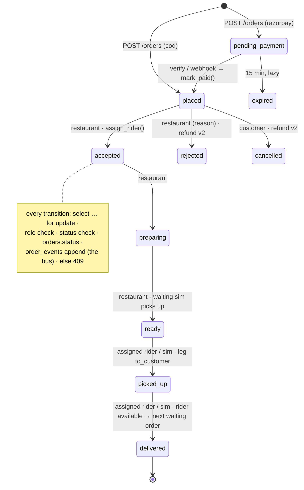
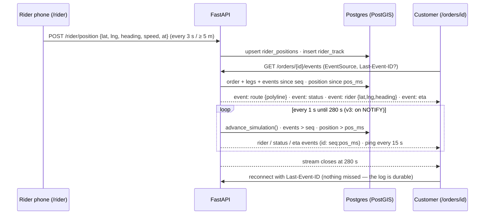
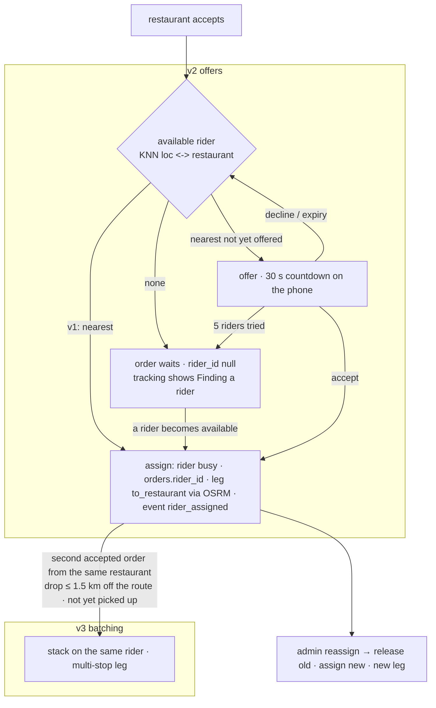
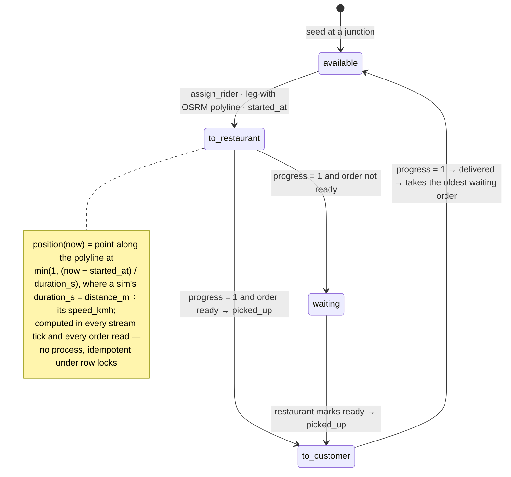
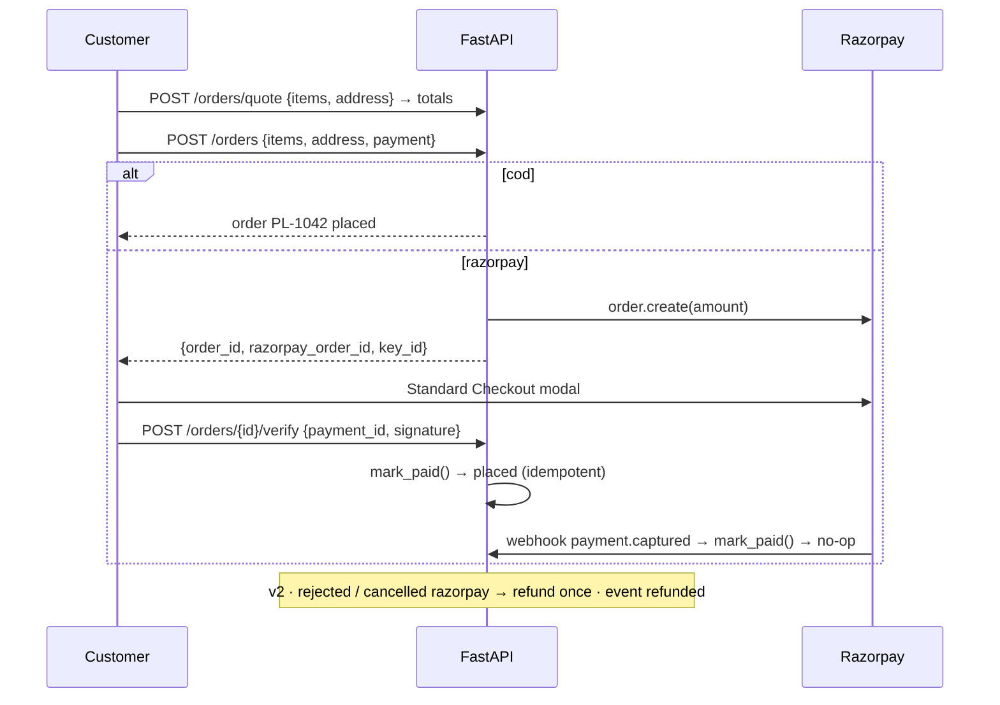
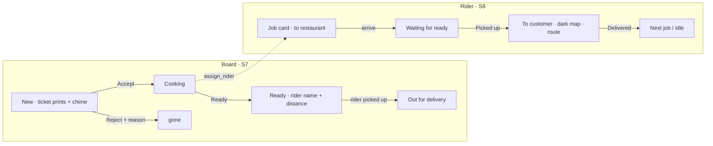
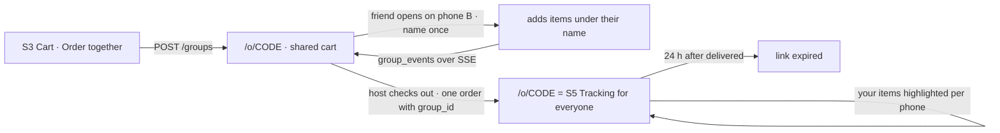

# Platter — User Flows & Screen Index

**Lifecycle step:** 3 of 17 · **Locked:** 2026-09-17 · Pairs with [03-requirements.md](03-requirements.md); every screen below gets a mockup in [04-ui-mockups.md](04-ui-mockups.md).

## Flow 1 — Pin to delivered (v1, the main path)

```mermaid
flowchart LR
  H[S1 Home · pin + restaurants] --> R[S2 Restaurant · menu]
  R -->|add items| C[S3 Cart sheet]
  C --> K[S4 Checkout · address · COD / Razorpay]
  K -->|COD → placed| T[S5 Tracking · Placed]
  K -->|Razorpay modal → verify → mark_paid| T
  T -->|restaurant accepts · rider assigned| T2[S5 Tracking · rider on the map]
  T2 -->|ready · picked up| T3[S5 Tracking · rider gliding · ETA]
  T3 -->|delivered| D[S5 Tracking · Delivered → rate in v2]
  D --> O[S6 Orders · history]
```

## Flow 2 — The order state machine (v1)

## Flow 3 — Live location: rider → bus → customer (v1, the hard part)

## Flow 4 — Dispatch (v1 nearest · v2 offers · v3 batching)

## Flow 5 — Simulated rider clock (v1)

## Flow 6 — Checkout money (v1) and refund (v2)

## Flow 7 — Restaurant board and rider app (v1)

## Flow 8 — Order together (v4)

## Screen index

| # | Screen | Route | Who | Version | Notes |
|---|---|---|---|---|---|
| S1 | Home | `/` | all | v1 · search / filters in v2 | Exists as landing; becomes the pin + restaurants list (map header, address search, cards with distance / ETA / fee) |
| S2 | Restaurant | `/r/[slug]` | all | v1 | Cover, info strip, menu by category with photos, veg marks, availability, add-to-cart |
| S3 | Cart | `/r/[slug]` (sheet) | customer | v1 · Order together in v4 | Items, quantities, note, totals preview, Checkout |
| S4 | Checkout | `/checkout` | customer | v1 | Address (saved / pin), payment COD / Razorpay, quote, Place order; Razorpay modal + dismissed state |
| S5 | **Tracking** | `/orders/[id]` | customer | v1 · rating in v2 · ETA band in v3 · group view in v4 | **The hero:** map with route, rider marker gliding, trail, ETA, status rail, order summary, cancel while placed |
| S6 | Orders | `/orders` | customer | v1 · reorder in v2 | History with status chips |
| S7 | **Restaurant board** | `/restaurant` | restaurant | v1 | Tablet columns New · Cooking · Ready · Out; ticket entrance; accept / reject / preparing / ready; today's totals |
| S8 | **Rider app** | `/rider` | rider | v1 · offers + online toggle in v2 · busy-area hint in v3 | Phone PWA: job card, dark map with route, Share my location, Picked up / Delivered |
| S9 | **Admin map** | `/admin` | admin | v1 · heatmap in v3 | Live map of orders + riders, stuck flags, reassign picker, today's numbers |
| S10 | Sign in / up + demo | `/sign-in`, `/sign-up` | all | v1 | Four demo cards: customer · restaurant · rider · admin |
| S11 | Addresses | `/addresses` | customer | v1 | Saved addresses with pins; add via search / drag |
| S12 | Restaurant menu | `/restaurant/menu` | restaurant | v1 (availability) · full editor in v2 | Availability toggles; v2 categories, items, photos, hours |
| S13 | Earnings + payouts | `/restaurant/earnings`, `/rider/earnings`, `/admin/payouts` | restaurant / rider / admin | v2 | Balances, entries, mark paid |
| S14 | Heatmap | `/admin/heatmap` | admin | v3 | Hex grid, hour slider |
| S15 | Order together | `/o/[code]` | anyone with the link | v4 | Shared cart with names → the tracking page after checkout |
| S16 | States | various | all | v1 | Finding a rider, restaurant closed, too far, cart from another restaurant, payment dismissed, empty history, offline rider |
